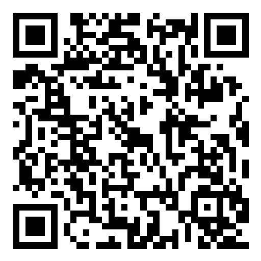

# Vela contracts

The manifest JSON Schemas Vela apps are validated against. Manifest version and
SDK version are separate, and each schema version is its own profile:

| Schema | Profile | What it describes |
| --- | --- | --- |
| `manifest-v2.schema.json` | SDK app | Bridge protocol 1, static release data migrations, explicitly granted app actions and desk widget declarations. |
| `manifest-v3.schema.json` | Managed web app | An existing self-hosted web server a host installs, runs as a local native service and publishes on its own web address. |
| `companion-v1.schema.json` | Companion app | A desktop app already running on the same computer that registers itself so the host can show its widgets and run its actions. Not a package or a manifest. |
| `surface-v1.schema.json` | Surface | A screen described as data: a tree of host-drawn panels, stats, tables and small desktops that a remote panel, companion or app sends for the host to draw. Not a package or a manifest. |

A managed web app keeps its own interface, accounts and data format. The host
owns the installation record, the service lifetime, the web gateway and the
declared recovery operations. A v3 manifest pins one release artifact per
operating system *and* CPU architecture by SHA-256 and exact size, states that
its executable runs with trusted native (host-user) permissions rather than
inside a sandbox, gives an argument vector rather than a shell string, and names
one relative persistent data directory. It cannot declare install, migration or
repair hooks, and it cannot ask for the SDK bridge, app storage, actions,
widgets or agent access.

A companion app keeps its own window, process and installer. It writes a small
registration file into the host's companions folder and serves three loopback
HTTP routes: status, widget summaries and actions. The owner connects it once.
It gets no SDK session, storage, credential or agent access, and it never calls
the host. [docs/COMPANIONS.md](docs/COMPANIONS.md) is the full protocol.

A surface is JSON, not code. The host draws each node with its own component,
refuses a type it has no component for, never fetches an address a surface
names, and asks before running any action a button requests.
[docs/SURFACES.md](docs/SURFACES.md) covers the limits the host enforces.

Validate app manifests with the matching schema before creating a release
artifact. The engine additionally validates capabilities, file boundaries,
migration results, artifact digests and path safety. `npm pack` creates a
portable contract artifact; no registry publication is performed by this
repository.

## Downloads

[GitHub Releases](https://github.com/jhd3197/vela-contracts/releases/latest) contain the
portable npm tarball and its checksum. These are GitHub downloads; npm registry
publication is not enabled. The `@vela` scope must be confirmed before an npm release.

## Contributing

See [CONTRIBUTING.md](CONTRIBUTING.md), [CHANGELOG.md](CHANGELOG.md),
[CONTRIBUTORS.md](CONTRIBUTORS.md) and [SECURITY.md](SECURITY.md).

## Support Vela

Vela is free and open source. If it saves you time, you can help keep it going:

- ⭐ [Star the repo](https://github.com/jhd3197/vela) — it costs nothing and helps a lot
- 💖 [GitHub Sponsors](https://github.com/sponsors/jhd3197)
- ☕ [Buy Me a Coffee](https://buymeacoffee.com/jhd3197)

### 💎 Crypto

| | Asset | Network | Address |
|:---:|---|---|---|
|  | **USDT** | **TRC-20** · Tron | `TTiCtqLauF1iSW2YGB3b78KmRxRqoLCgeL` |
|  | **USDT / ETH** | **ERC-20** · Ethereum | `0xD13D5355Fa214e8317fea2ff192a065BaeC13527` |
|  | **BTC** | **Bitcoin** | `bc1qatx67n3qxdvuv3arc9j8aytk34f22g02k9c7vr` |
|  | **SOL** | **Solana** | `AWXzqtBEgUfteHPQtDegsZ6D5y57M3GGdKPD8rR7h6xu` |

## License

[MIT](LICENSE). Created and maintained by [Juan Denis](https://github.com/jhd3197).
